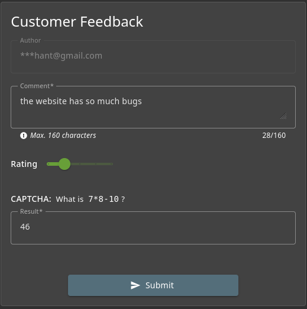
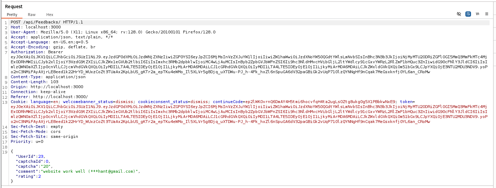
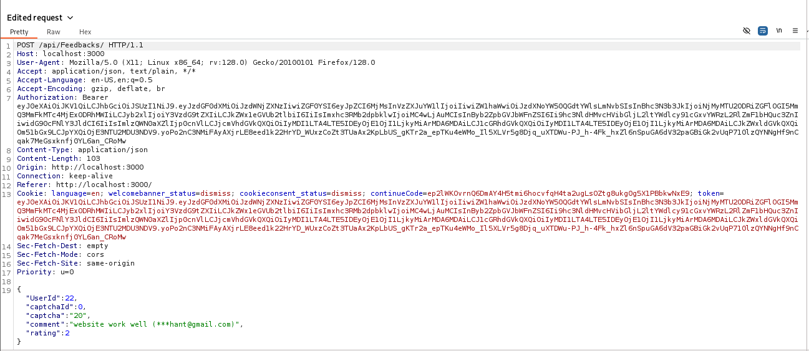

# Juice Shope: Forged Feedback Writeup

## Challenge Overview  
Title: Forged Feedback
Difficulty: 3/6  
Category: Broken Access Control
Description: Post some feedback in another user's name.  

## Tools Used:  
1. Web Browser: To create a Customer Feedback .  
2. BurpSuite: To Craft the request.

## Methodology and Solution

### Step 1: Create Your own Customerr Feeedback.  
I created my own customer Feedback and submit it while intersepting Burp. And capture the reuqest in Burpsuite.  
 

### Step 2: Craft the request.  
After caputring the request, I observed that website using api for Customer Feedback. And api using IDs for each users instead of unique encrypted code.  
In request body I simply changed Userid 23 to 22.  
Original Request :  

Crafted Request: 
  

And Done... Go and Look your Score Board.
