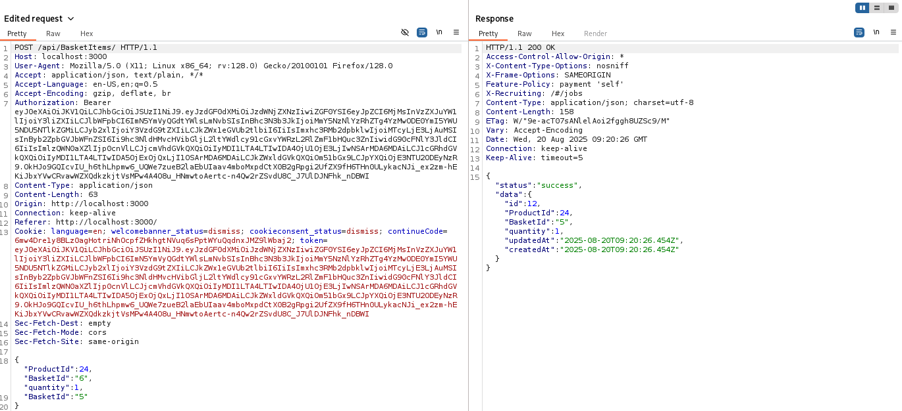

# Juice Shope: Manipulate Basket  Writeup 

## Challenge Overview  
Title: Manipulate Basket
Difficulty: 3/6  
Category: Broken Access Control  
Description: Put an additional product into another user's shopping basket.  
## Tools Used:  
1. Web Browser: To nevigate shopping basket.  
2. BurpSuite: To Intersept and Manipulate Requests.

## Methodology and Solution

### Step 1: capture basket request. 
I first decided to capture some basket request and monitor them.  After speding some time on that all request and by taking help of juice-shop hint, I got this request.  


### Step 2: Final Change  
The challenge was to add items in another user's basket. As I solved previous basket challenge, I got to know that every user and their baskets are associated with IDs.  
So, I add another user ID in my request instead of replacing my ID with another user ID.  
```html
"BasketId":"5"
```
And That's it......
