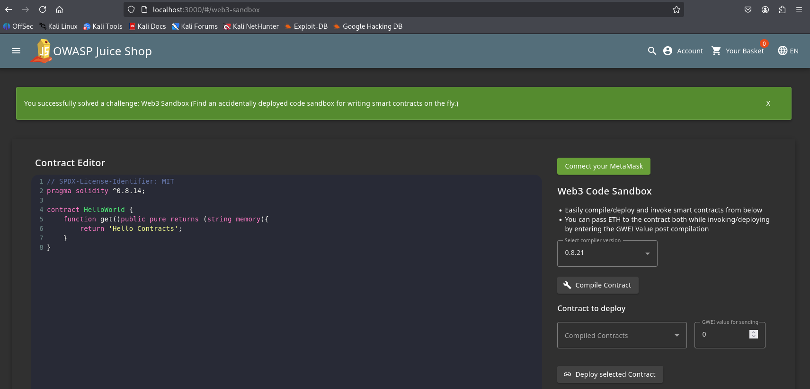

# Juice Shope: Web3 Sandbox

## Challenge Overview  
Title: Web3 Sandbox
Difficulty: 1/6  
Description: Find an accidentally deployed code sandbox for writing smart contracts on the fly..  

## Tools Used:  
1. Web Browser: To look for some hints related to Web3 technology and access Sandbox page.  

## Methodology and Solution
This challenge is pretty simple. I only spend some time on looking for web3 technology content. After spending some time, I realize this challenge is very similar to admin page.  
After few guesses I got the page to acccess Web2 Sandbox. Simply Open this URL:
```html
http://localhost:3000/#/web3-sandbox
```

