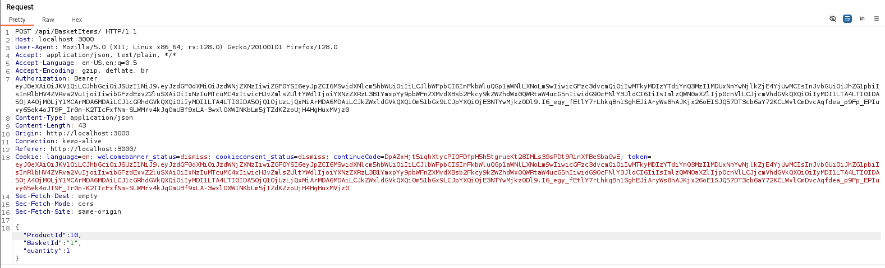
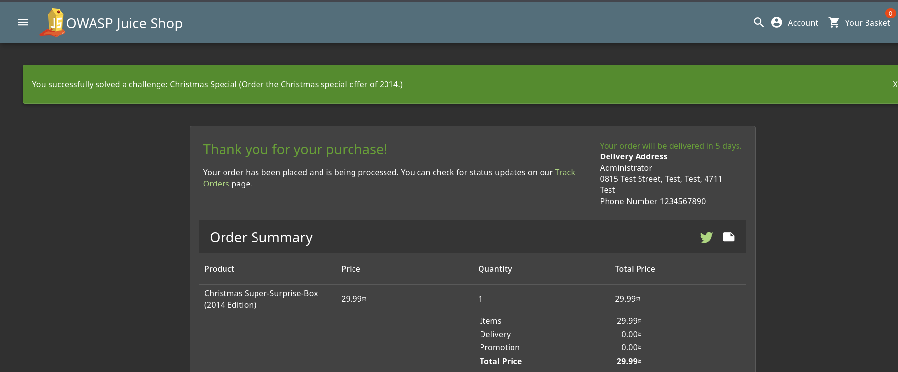

# Juice Shop: Christmas Special  

## Challenge Overview  
- **Title:** Christmas Special  
- **Difficulty:** 4/6  
- **Description:** Order the Christmas special offer of 2014.  

---

## Tools Used  
- **Browser** – To trigger "Add to Basket" requests.  
- **Burp Suite** – To intercept and manipulate HTTP requests.  

---

## Methodology and Solution  

This was a **4-star challenge**, which made it a bit tricky compared to the earlier ones.  

### 1. Identifying the Target Product  
- While working on the previous challenge (**Database Schema**), I had already extracted the full list of products and their IDs from the database.  
- Among these, I noticed the **deleted product** called `"Christmas Special"`.  

---

### 2. Intercepting a Basket Request  
- To add it to my basket, I first logged into my **admin account**.  
- Then, I added a **random product** to the basket to generate a valid "Add to Basket" request.  
- Using **Burp Suite**, I intercepted this request and examined the product ID field.  

---

### 3. Manipulating the Product ID  
- In the intercepted request, I replaced the random product’s ID with the **Christmas Special product ID** (from the DB schema).  
- After forwarding the modified request, I checked my basket…  
- The **Christmas Special** product appeared, even though it was deleted/hidden from the normal UI.
- 

---

### 4. Completing the Challenge  
- Finally, I proceeded to **checkout** with the Christmas Special in my basket.  
- The order was placed successfully, and the challenge was solved.
-   

---

## Result  
- Successfully ordered the **2014 Christmas Special offer** by exploiting hidden/deleted product IDs.  
- Challenge completed  

---

