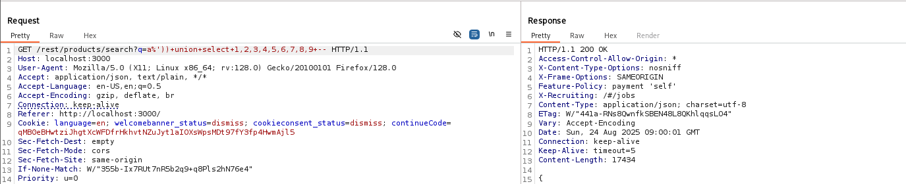
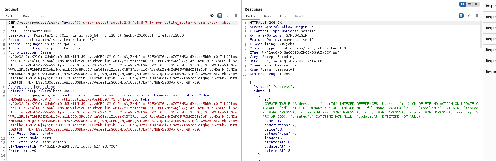

# Juice Shop: Database Schema  

## Challenge Overview  
- **Title:** Database Schema  
- **Difficulty:** 3/6  
- **Description:** Exfiltrate the entire DB schema definition via SQL Injection.  

---

## Tools Used  
- **Browser** – To trigger search queries.  
- **Burp Suite** – To intercept and manipulate requests.  

---

## Methodology and Solution  

The objective was to exfiltrate the **entire database schema** using SQL Injection.  

### 1. Identifying Injection Point  
- I started by capturing a **search request** in Burp Suite.  
- In the `?q=` parameter, I entered the following test payload:  
```html
 apple'--
```
- The application responded with an error:  
SELECT * FROM Products WHERE ((name LIKE '%apple'%' OR description LIKE '%apple'%') AND deletedAt IS NULL) ORDER BY name  

- This confirmed that the search query was vulnerable to **SQL Injection**.  

---

### 2. Finding the Number of Columns  
- Next, I needed to determine how many columns the query was returning.  
- I used the following **UNION SELECT** payload:  
```html
a%')) UNION SELECT 1,2,3,4,5,6,7,8,9--
```
- The response confirmed the table had **9 columns** available for injection.  

---

### 3. Extracting Database Schema  
- After confirming the structure, I researched for a proper payload to enumerate schema information.  
- I found that SQLite stores schema definitions in the `sqlite_master` table.  
- Using this, I injected the following payload:  
```html
asd')) UNION SELECT sql,2,3,4,5,6,7,8,9 FROM sqlite_master WHERE type='table'--
```

- This query successfully returned the **entire schema definition**, including all table names and their structures.  

---

## Result  
- The database schema was successfully exfiltrated.  
- Challenge completed 

---

