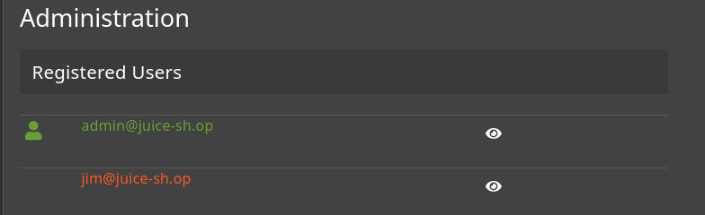

# Juice Shop: Login Jim  

## Challenge Overview  
- **Title:** Login Jim  
- **Difficulty:** 3/6  
- **Category:** Injection Attack  
- **Description:** Log in with Jim's user account.  

---

## Tools Used  
- **Browser** – To navigate the application.  
- **Burp Suite** – To intercept and test requests.  
- **SQL Injection Payloads** – For bypassing authentication.  

---

## Methodology and Solution  

For this challenge, the goal was to log in as **Jim** by exploiting an injection vulnerability.  

1. **Identifying Jim's Email ID**  
   - First, I logged in as the admin user to look into the system data.  
   - From the admin panel, I found Jim’s registered email ID:  
     ```
     jim@juice-sh.op
     ```
     

2. **Crafting SQL Injection Payload**  
   - Since the login form was vulnerable, I attempted an **SQL Injection bypass**.  
   - By injecting directly in the password field, I was able to trick the system into authenticating without knowing Jim’s actual password.  

3. **Successful Payload**  
   - I used the following payload during login:  
     ```
     Email: jim@juice-sh.op'--  
     Password: test
     ```
   - Here, the single quote `'` and comment operator `--` terminated the SQL query, bypassing password verification.
   - 
   

4. **Result**  
   - The login request was successfully bypassed, and I gained access to Jim’s account.  
   - Challenge completed! 🎯  

--- 
