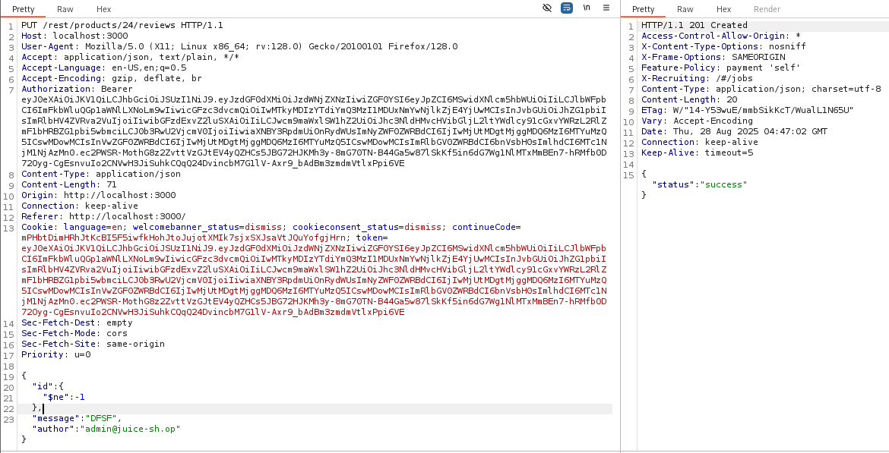

# Juice Shop: NoSQL Manipulation  

## Challenge Overview  
- **Title:** NoSQL Manipulation  
- **Difficulty:** 4/6  
- **Description:** Update multiple product reviews at the same time.  

---

## Tools Used  
- **Browser** – To trigger review queries.  
- **Burp Suite** – To intercept and manipulate requests.  

---

## Methodology and Solution  

After solving the **NoSQL DoS** challenge, I gained a better understanding of how **NoSQL injection** works.  

This time, the goal was to **update multiple product reviews simultaneously** instead of a single one.  

---

### 1. Capturing the Request  
- I submitted a product review normally.  
- Using **Burp Suite**, I intercepted the `PATCH` request that updates the review.  

---

### 2. Manipulating the Request  
Normally, the request looks like this:  

```json
{
  "id": 7,
  "message": "Nice product!"
  "author":"admin@juice-sh.op"
}
```
To update multiple reviews at once, I replaced the id field with a NoSQL operator:
```json
{
  "id": {
    "$ne": -1
  },
  "message": "Nice product!"
  "author":"admin@juice-sh.op"
}
```


### 3. Explanation of Payload
"$ne": -1 → This means “id not equal to -1”, which matches all product IDs in the database.  
By removing the specific product ID and injecting this condition, the update applies to all reviews simultaneously  

### 4. Result
After forwarding the manipulated request, the review message was updated for multiple products at once.  
Challenge solved – successfully performed NoSQL manipulation to mass-update reviews.  
