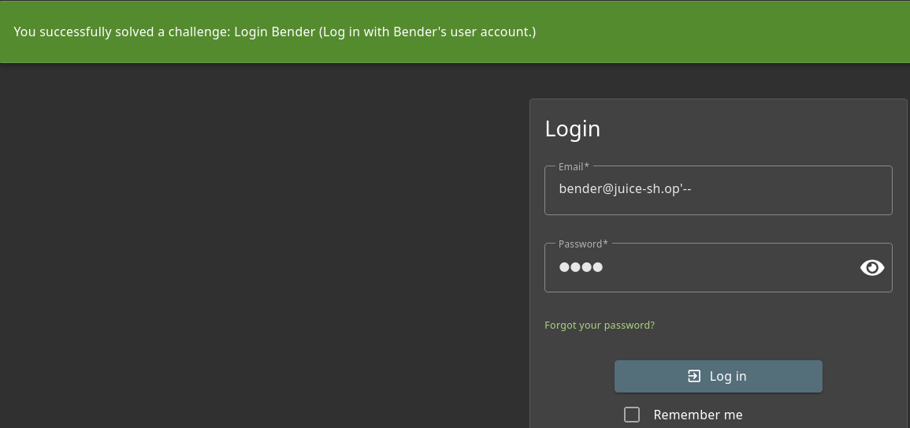

# Juice Shop: Login Bender  

## Challenge Overview  
- **Title:** Login Bender
- **Difficulty:** 3/6  
- **Category:** Injection Attack  
- **Description:** Log in with Bender's user account. 

---

## Tools Used  
- **Browser** – To navigate the application.  
- **Burp Suite** – To intercept and test requests.  
- **SQL Injection Payloads** – For bypassing authentication.  

---

## Methodology and Solution  

For this challenge, the goal was to log in as **Bender** by exploiting an injection vulnerability.  

1. **Identifying Bender's Email ID**  
   - First, I logged in as the admin user to look into the system data.  
   - From the admin panel, I found Bender’s registered email ID:  
     ```
     bender@juice-sh.op
     ```

2. **Crafting SQL Injection Payload**  
   - Since the login form was vulnerable, I attempted an **SQL Injection bypass**.  
   - By injecting directly in the password field, I was able to trick the system into authenticating without knowing bender’s actual password.  

3. **Successful Payload**  
   - I used the following payload during login:  
     ```
     Email: bender@juice-sh.op'--  
     Password: test
     ```
     
     
   - Here, the single quote `'` and comment operator `--` terminated the SQL query, bypassing password verification.

4. **Result**  
   - The login request was successfully bypassed, and I gained access to bender’s account.  
   - Challenge completed! 🎯  

---
 
