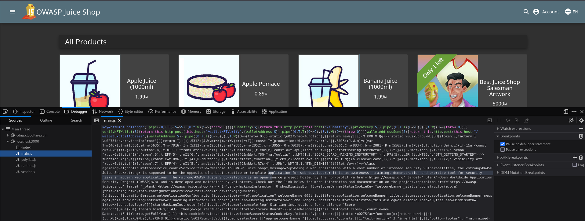

# OWASP-Juice-Shop
OWASP Juice Shop Walkthrough. If you stuck somewhere while solving OWASP Juice Shop Challenges then this Page is for you. You'll find here solution for OWASP Juice Shop Challenges.

First Let's Start with Installing OWASP Jucie Shop in Kali Linux.https://github.com/CyberInteI/OWASP-Juice-Shop/blob/main/README.md                                       
The most Safest Way is to Pull Docker Image.

Step 1: Install Docker  
sudo apt update  
sudo apt install docker.io -y  
sudo systemctl enable docker --now  

Step 2: Pull Juice Shop Image  
sudo docker pull bkimminich/juice-shop  

Step 3: Run Juice Shop  
sudo docker run --rm -p 3000:3000 bkimminich/juice-shop  

Step 4: Access in Browser  
http://localhost:3000  

Once Done! Be ready to dive into the real life web vulnerability chanllenges........  
You'll find all challenges category wise in this repository.  

Our First Challenge it to Find Score-Board Page of website where we'll get all Challenges list.  
To find Score-Board page, We'll look the Keyword 'Score' in every file of website.  

Open Developer option in FireFox --> Go to Debugger.  

In Main.js file looke for 'Score' keyword and you'll find 'routerLink","/score-board'  
Now we know the path to the scoreboard. We can use it as a URL parameter to find the hidden scoreboard in the OWASP Juice Shop.  

http:localhost:3000/#/score-board  
