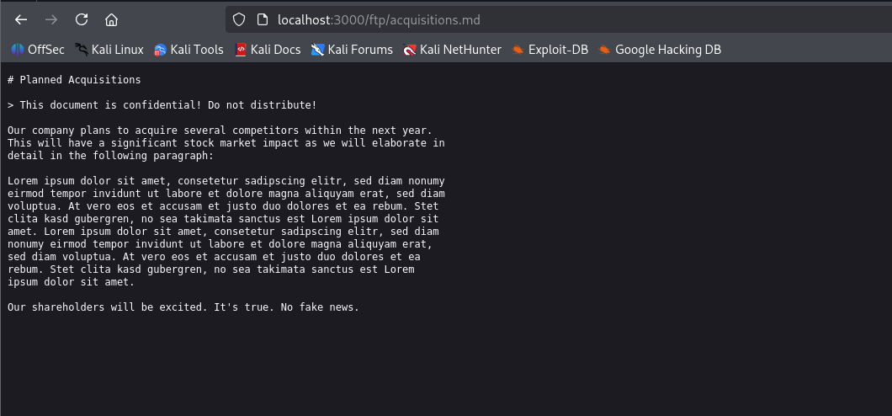

#  Juice Shop: Confidential Document  

##  Challenge Overview  
- **Title:** Confidential Documents  
- **Difficulty:** 1/6  
- **Description:** Gain access to a confidential document hidden within the Juice Shop application.  

---

##  Tools Used  
- None (just a browser and some intuition!)  

---

##  Methodology and Solution  

This was one of the simplest challenges in Juice Shop. The key idea was to look for **hidden resources** within the application.  

### Step 1: Thinking about File Access  
The challenge description hinted at a “confidential document.” In many cases, applications store sensitive files in publicly accessible directories. A common one for file sharing is **FTP-like paths**.  

So I decided to check if Juice Shop had an `/ftp` directory exposed.  

### Step 2: Direct Access Attempt  
I navigated to:  
```html
http://localhost:3000/ftp/
```

And sure enough, the directory listing was available. Inside it, I discovered the **acquisitions.md** file:  
```html
http://localhost:3000/ftp/acquisitions.md
```

### Step 3: Retrieving the Document  
Opening this file revealed the “confidential” content, and the challenge was instantly solved ✅  

  

---

## ✅ Key Takeaways  
- Sometimes, solving a challenge requires **no tools at all** — just logical guessing and curiosity.  
- Directory brute-forcing or simply trying common endpoints (`/ftp`, `/admin`, `/backup`, etc.) can reveal sensitive data.  
- Even a basic misconfiguration like exposing an **FTP directory over HTTP** can lead to data leakage.  


