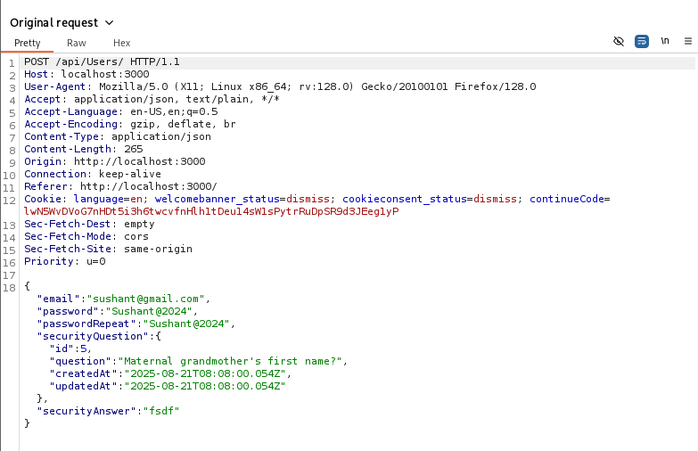

#  Juice Shop: Empty User Registration  

##  Challenge Overview  
- **Title:** Empty User Registration  
- **Difficulty:** 2/6  
- **Description:** Register a user with an empty email and password.  

---

##  Tools Used  
- **Browser** – to access and fill the registration form  
- **Burp Suite** – to intercept and modify the registration request  

---

##  Methodology and Solution  

### Step 1: Fill Out the Registration Form  
I started by navigating to the **User Registration** page on Juice Shop. Normally, it requires a valid email, password, and security question.  

### Step 2: Capture the Request in Burp Suite  
With Burp Suite running, I submitted the registration form with placeholder values. The request was captured in **Proxy > HTTP history**.  

### Step 3: Manipulate the Request  
Then, I **removed the values** of the email and password fields directly from the request body, making them empty:  

```json
{
  "email": "",
  "password": "",
  "passwordRepeat": "",
  "securityQuestion": {
    "id": 1,
    "question": "Your eldest sibling’s middle name?",
    "createdAt": "2025-08-16T08:00:00.000Z",
    "updatedAt": "2025-08-16T08:00:00.000Z"
  },
  "securityAnswer": "test"
}
```

### Step 4: Forward the Request

After modifying the request, I forwarded it to the server.
Juice Shop accepted the registration with empty credentials, completing the challenge.

