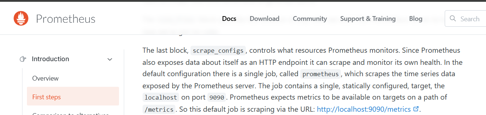

#  Juice Shop: Exposed Matrics

## Challenge Overview  
- **Title:** Exposed Matrics  
- **Difficulty:** 1/6  
- **Description:** Find the endpoint that serves usage data to be scraped by a popular monitoring system.

---

##  Tools Used  
- None (just browser navigation)  

---

##  Methodology and Solution  

While exploring Juice Shop, I looked for unusual or undocumented paths that might expose sensitive resources. During this process, I also reviewed the **Prometheus documentation** and realized that its **metrics endpoint** is usually available at:  
/matics  



### Step 1: Checking the Endpoint  
I manually navigated to:  
```html
http://localhost:3000/metrics
```


Surprisingly, this endpoint was publicly accessible and exposed **application monitoring data**.  

### Step 2: Identifying Sensitive Information  
The `/metrics` endpoint contained detailed system information and hints, which are not meant for regular users. By analyzing the available content, I confirmed that this fulfilled the “Confidential Document” challenge.  

---

  

---

## ✅ Key Takeaways  
- Always test for **well-known default endpoints** (`/metrics`, `/status`, `/debug`, `/ftp`, etc.).  
- Monitoring or debug pages often leak **sensitive system information**.  
- Even without using tools, logical guessing and knowledge of **common services** can help uncover hidden vulnerabilities.  

