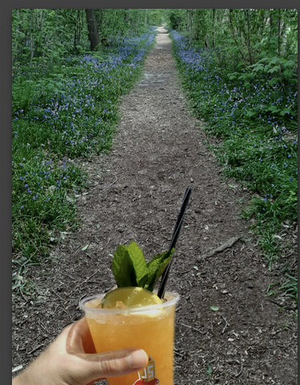
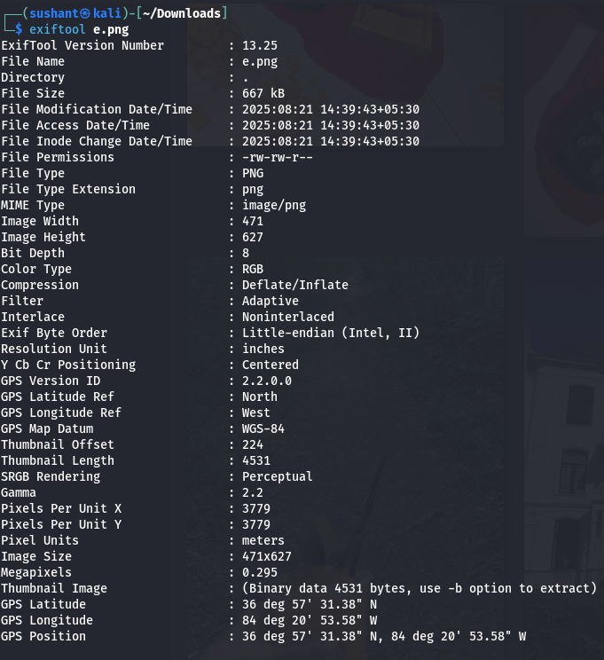
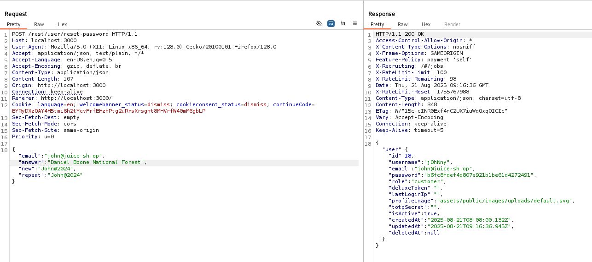

#  Juice Shop: Meta Geo Stalking  

##  Challenge Overview  
- **Title:** Meta Geo Stalking  
- **Difficulty:** 2/6  
- **Description:** Determine the answer to John's security question by analyzing the metadata of his uploaded photo on the Photo Wall and use it to reset his password.  

---

##  Tools Used  
- **Browser** – For downloading John’s photo from the Photo Wall  
- **ExifTool** – To extract metadata (EXIF data) from the image  
- **Burp Suite** – To capture and manipulate the password reset request  

---

## 🧩 Methodology and Solution  

### Step 1: Download John’s Photo  
From the **Photo Wall** feature in Juice Shop, I located John’s uploaded image and saved it to my local system.  

### Step 2: Extract Metadata Using ExifTool  
I used the `exiftool` command to extract the photo’s metadata:  

```bash
exiftool johns-photo.jpg
```
Among the extracted information, I found GPS coordinates embedded in the EXIF data.

### Step 3: Analyze GPS Coordinates
Using Google Maps, I searched for the location corresponding to those coordinates. The place pointed to the Daniel Boone National Forest, which is known for hiking activities.

### Step 4: Reset Password via Security Question

Next, I initiated the Forgot Password mechanism for John’s account. His security question was:

"What’s your favourite place to go for hiking?"

I entered the answer as:
```html
Daniel Boone National Forest
```

This matched the correct answer, allowing me to successfully reset John’s password and complete the challenge.
