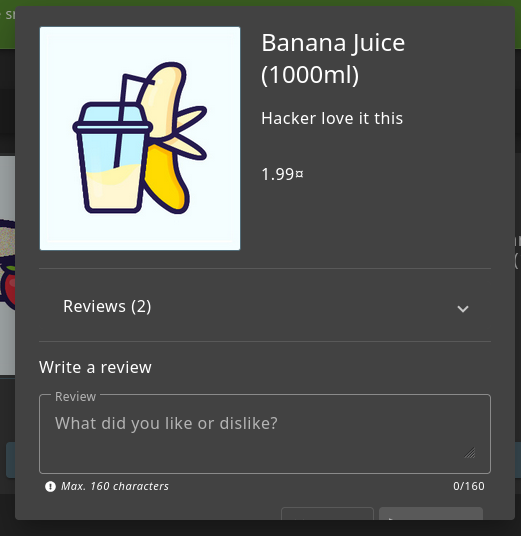

# Juice Shope: API-Only XSS & Admin Login

## Challenge Overview  
Title: API-Only XSS
Difficulty: 3/6
Description: Perform a persisted XSS attack with <iframe src="javascript:alert(`xss`)"> without using the frontend application at all.  

## Tools Used:  
1. Web Browser: To nevigate through website and looking for API requests.  
2. BurpSuite: To Intersept and Manipulate Requests.

## Methodology and Solution

### Step 1: Capture API Requests.  
Out First step toward this challenge is to look for API request.  
Open Juice Shop and Burpsuite and intersept the reuqests.
So, firstly i opened Juice Shop and nevigated through website and capture some requests, and i found that website is using API for 'Product' and 'Quantity'.  
Now, I captured the requests Get/API/quantity.  and Send it to Burp Repeater.  
  

### Step 2: Manipulating Serverside Data
After spending some time on this request i changes the Request Method to OPIONS to see which methods are allowed to User. And I got this:  
  

As we can see user is allowed to use GET,HEAD,PUT,PATCH,POST,DELETE. Our goal is to manipulate serverside data.  
Now will try to manipulate Description of a product.  
But when i tried to manipulate the Serverside data (Description) the Changes doesn't effected. Then i remeber only admin has such kind of permissions.  
Then i login as admin and this Step covers our one more challenge. i.e Login Admin Challenge.  
  

### Step 3: Login As Admin
Now I Login as admin. The most common techniques here I used which is SQL Injection bypass.  Enter Following Payload to bypass Login.  
Username: 'OR 1=1--
Password: test  
And now you are logined as Admin.

### Step 4: Again Manipulating Serverside Data  
Now after logining copy JSON Web Token (JWT) and Cookie of Admin to our previously captured request. And also add 
```html
Content-Type: application/json
```
And the Description we want to Changes, and after PUT method add ID of product we want to change. Here we'll a Payload to Exploit XSS:
```html
<iframe src="javascript:alert(`xss`)">
```
  

And now you can see the Description is Changed.  
  
