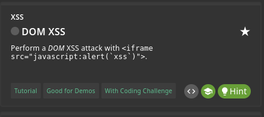
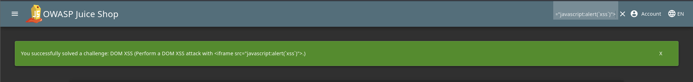

Our First XSS challenge is DOM XSS. 
  

DOM-based XSS vulnerabilities usually arise when JavaScript takes data from an attacker-controllable source, such as the URL, and passes it to a sink that supports dynamic code execution, such as eval() or innerHTML. This enables attackers to execute malicious JavaScript, which typically allows them to hijack other users' accounts.  

To solve this challenge firstly we need to look for input field. And the most common input files in website is 'Searchbar'.  
We'll input the DOM-based-XSS payload in searchbar.  
Payload:- <iframe src="javascript:alert(`xss`)">X --> Hit Enter.
  

Congratulations..........  
our first Challenge is Solved.
