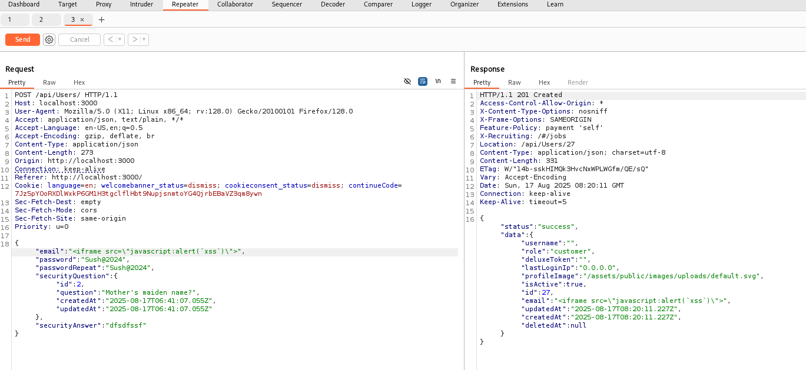
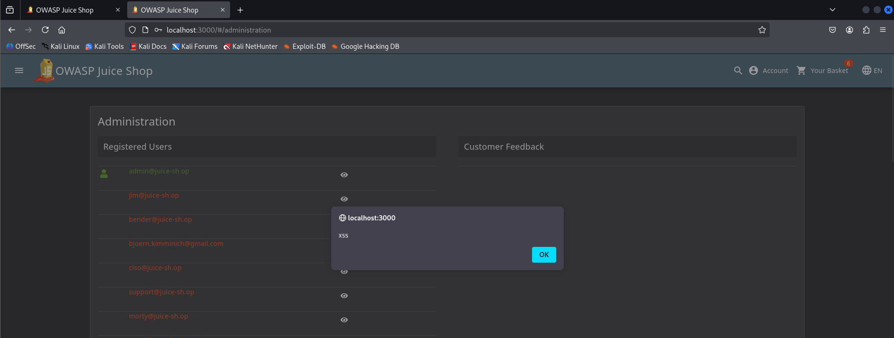

# Juice Shope: Client-Side XSS Protection  

## Challenge Overview  
Title: Client-Side XSS Protection  
Difficulty: 3/6  
Description: Perform a persisted XSS attack with <iframe src="javascript:alert(`xss`)"> bypassing a client-side security mechanism.  

## Tools Used:  
1. Web Browser: To nevigate through website and capture login request.  
2. BurpSuite: To Intersept and Manipulate Requests.

## Methodology and Solution

### Step 1: Capture Login Request.  
Firstly, I captured a User Registration request in Burpsuite and Add a payload at the place of email.
  

Then submit the request.

### Step 2: Login as Admin
In previous XSS Challeng I solve the Login Admin Challenge. Now in Previous step I created a new user.  
Now login as admin and go to /administration section. Simply put the URL:
```html
http://localhost:3000/#/administration
```
Here I Solved one more challenge i.e Administration Section Challenge. As I enter this section Challenge is solved.  
  

## Explaination  
In many web pages developer use input validation to protect website from attack like SQL and XSS. Our Challenge is to bypass this protection and perform persistant XSS attack.  
For this I targeted Admin. I created a user and added payload in email. As soon as the admin open the Administration sectin the payload get executed and attack done.  
It is considered as one of the dangerous attack in Website.  
