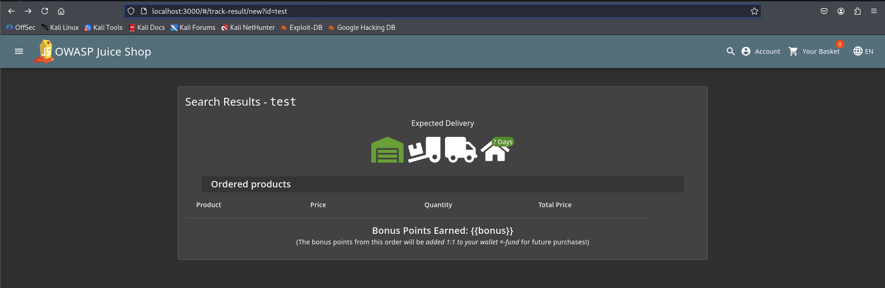
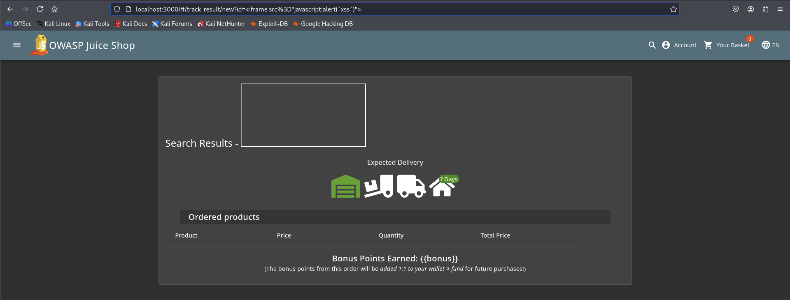

# Juice Shope: Reflected XSS  

## Challenge Overview  
Title: Reflected XSS
Difficulty: 2/6

## Tools Used:  
1. Web Browser: To nevigate through website looking for reflected input filed  
2. Developer Tool: To Inspect HTML and Javascript files for exploitation.

## Methodology and Solution

### Step 1: Initial Payload Testing (Not Working)  
firstly i tried the payload given in score-board challenge and tested it in URL, In Search field next to ?q= parameter.  
```html
<iframe src="javascript:alert(`xss`)">
```
But it didn't work. The reason was - search parameter is not reflected.

### Step 2: Look for Reflected parameter
Then i started looking for reflected parameter. where user input will directly display on web page. while nevigating i found 'Tack order' page.
  

And here we got our Reflected parameter

### Step 3: Craft and Insert Payload  
Now, let's craft our payload to inject in '?id=' parameter.
Payload:
```html
localhost:3000/#/track-resulti?/new?id=<iframe src%3D"javascript:alert(`xss`)">
```
And BOOOM.... Challenge Solved.  

## Solution Explaination  
Firstly we need to under why we  need only user input parameters which reflect as it is in web page.  

This XSS challenge originates from an unsafely processed user input via an HTTP header. The difficulty lies in finding the attack path whereas the actual exploit is rather business as usual. Finding a piece of information displayed in the UI that could originate from an HTTP header
You might have to look into less common or even proprietary HTTP headers to find the leverage point Adding insult to injury, the HTTP header you need will never be sent by the application on its own Perform a reflected XSS attack Reflected Cross-site Scripting (XSS) occur when an attacker injects browser executable code within a single HTTP response. The injected attack is not stored within the application itself; it is non-persistent and only impacts users who open a maliciously crafted link or third-party web page. The attack string is included as part of the crafted URI or HTTP parameters, improperly processed by the application, and returned to the victim.

